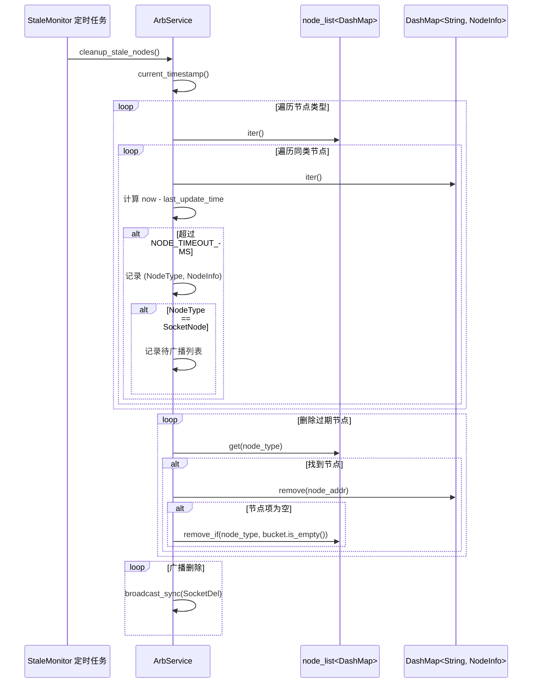

# 失效节点判定序列图

```mermaid
sequenceDiagram
    participant 定时任务 as StaleMonitor 定时任务
    participant 仲裁服务 as ArbService
    participant 节点表 as node_list<DashMap>
    participant 节点项 as DashMap<String, NodeInfo>

    定时任务->>仲裁服务: cleanup_stale_nodes()
    仲裁服务->>仲裁服务: current_timestamp()

    loop 遍历节点类型
        仲裁服务->>节点表: iter()
        loop 遍历同类节点
            仲裁服务->>节点项: iter()
            仲裁服务->>仲裁服务: 计算 now - last_update_time
            alt 超过 NODE_TIMEOUT_MS
                仲裁服务->>仲裁服务: 记录 (NodeType, NodeInfo)
                alt NodeType == SocketNode
                    仲裁服务->>仲裁服务: 记录待广播列表
                end
            end
        end
    end

    loop 删除过期节点
        仲裁服务->>节点表: get(node_type)
        alt 找到节点
            仲裁服务->>节点项: remove(node_addr)
            alt 节点项为空
                仲裁服务->>节点表: remove_if(node_type, bucket.is_empty())
            end
        end
    end

    loop 广播删除
        仲裁服务->>仲裁服务: broadcast_sync(SocketDel)
    end
```
